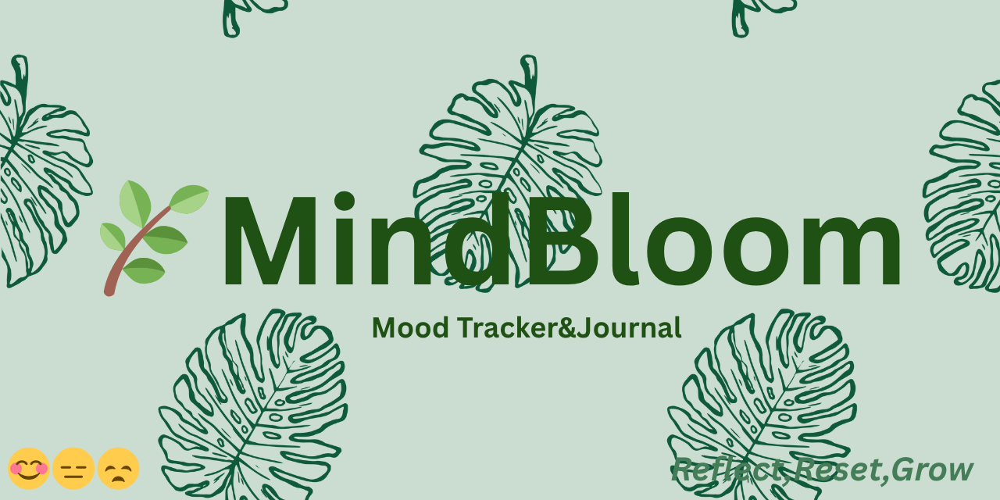

## 📸 Banner

---

# 🌿 MindBloom

A calming, minimalist web app for journaling and daily mood check-ins. Built with HTML, CSS, and JavaScript — designed to help you pause, reflect, and grow 🌱

---

## ✨ Features

- 😊 Mood tracker (happy, neutral, sad).
- 📓 Daily journal input.
- 💬 Random motivational quotes.
- 📚 Entry History.
- 💾 Auto-save with `localStorage`.
- 📱 Mobile-friendly + no login needed.
- 📊 Mood Trends (Last 7 Days).
- 📝 Last Check-in.

---

## 🔗 Live Demo

👉 [Try MindBloom in your browser](https://meamae-space.github.io/MindBloom)

---

## 🚀 How It Works

- Choose how you're feeling (😊 😐 😞)
- Write a short reflection in the journal box
- Click **Save Check-in** — it stores everything in your browser
- Refresh and get a random quote each time

---

## 📜 License

MIT License  
Feel free to use, modify, and share.

---

## 💚 Created for Hack Club’s Summer of Making
Made with love, code, and calm.

